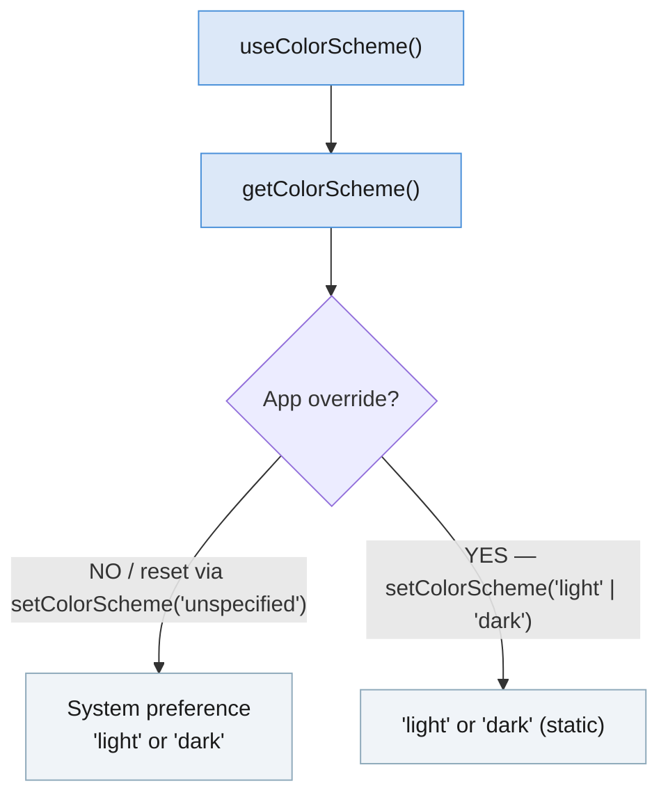

import Tabs from '@theme/Tabs'; import TabItem from '@theme/TabItem'; import constants from '@site/core/TabsConstants';

```tsx
import {Appearance} from 'react-native';
```

`Appearance` 모듈은 사용자의 선호하는 시스템 색상 구성표(라이트 또는 다크)와 같은 외관 기본 설정에 대한 정보를 노출합니다.

#### 개발자 참고 사항

<Tabs groupId="guide" queryString defaultValue="web" values={constants.getDevNotesTabs(["android", "ios", "web"])}>

<TabItem value="web">

:::info
`Appearance` API는 W3C의 [미디어 쿼리 초안](https://drafts.csswg.org/mediaqueries-5/)에서 영감을 받았습니다. 색상 구성표 기본 설정은 [`prefers-color-scheme` CSS 미디어 기능](https://developer.mozilla.org/en-US/docs/Web/CSS/@media/prefers-color-scheme)을 모델로 합니다.
:::

</TabItem>
<TabItem value="android">

:::info
색상 구성표 기본 설정은 Android 10(API 레벨 29) 이상 기기에서 사용자의 라이트 또는 [다크 테마](https://developer.android.com/guide/topics/ui/look-and-feel/darktheme) 기본 설정에 매핑됩니다.
:::

</TabItem>
<TabItem value="ios">

:::info
색상 구성표 기본 설정은 iOS 13 이상 기기에서 사용자의 라이트 또는 [다크 모드](https://developer.apple.com/design/human-interface-guidelines/ios/visual-design/dark-mode/) 기본 설정에 매핑됩니다.
:::

:::note
스크린샷을 찍을 때, 기본적으로 색상 구성표가 라이트 모드와 다크 모드 사이에서 깜빡일 수 있습니다. iOS가 두 색상 구성표 모두에 대한 스냅샷을 찍고 색상 구성표로 사용자 인터페이스를 업데이트하는 것이 비동기적으로 이루어지기 때문입니다.
:::

</TabItem>
</Tabs>

## 예제

`Appearance` 모듈을 사용하여 사용자가 다크 색상 구성표를 선호하는지 확인할 수 있습니다:

```tsx
const colorScheme = Appearance.getColorScheme();
if (colorScheme === 'dark') {
  // Use dark color scheme
}
```

색상 구성표는 즉시 사용할 수 있지만, `setColorScheme()`으로 재정의되지 않은 경우(예: 일출이나 일몰 시 예약된 색상 구성표 변경) 변경될 수 있습니다. 사용자가 선호하는 색상 구성표에 따라 달라지는 렌더링 로직이나 스타일은 값을 캐시하는 대신 매번 렌더링 시 이 함수를 호출하는 것이 좋습니다.

**권장 사항:** [`useColorScheme`](usecolorscheme) hook을 사용하세요.

### 앱 수준 재정의

`setColorScheme()`은 애플리케이션 수준에서 색상 구성표를 재정의합니다 — 시스템 설정이나 다른 애플리케이션에는 영향을 미치지 않습니다. `'unspecified'`를 전달하면 재정의가 제거되고 시스템 기본 설정이 복원됩니다.



---

# 참조

## 메서드

### `getColorScheme()`

```tsx
static getColorScheme(): 'light' | 'dark' | 'unspecified' | null;
```

현재 활성 색상 구성표를 반환합니다. 이 값은 런타임에 시스템 수준(예: 일출이나 일몰 시 예약된 색상 구성표 변경) 또는 `setColorScheme()`을 통한 앱 수준 재정의 시 변경될 수 있습니다.

반환 값:

- `'light'`: 라이트 색상 구성표가 적용됩니다.
- `'dark'`: 다크 색상 구성표가 적용됩니다.
- `'unspecified'`: **_반환되지 않음_** (타입이 잘못 지정됨).
- `null`: 네이티브 Appearance 모듈을 사용할 수 없는 경우 반환될 수 있습니다.

참고: [`useColorScheme`](usecolorscheme) (hook).

---

### `setColorScheme()`

```tsx
static setColorScheme('light' | 'dark' | 'unspecified'): void;
```

애플리케이션이 항상 라이트 또는 다크 인터페이스 스타일을 채택하도록 강제합니다. 변경 사항은 애플리케이션과 그 안의 모든 네이티브 요소(Alerts, Pickers 등)에 적용됩니다.

이것은 앱 수준 재정의입니다 — 시스템의 선택된 인터페이스 스타일이나 다른 애플리케이션에 설정된 스타일에는 영향을 미치지 않습니다.

지원되는 값:

- `'light'`: 라이트 색상 구성표를 적용합니다.
- `'dark'`: 다크 색상 구성표를 적용합니다.
- `'unspecified'`: 시스템 색상 구성표를 따릅니다 (재정의를 제거합니다).

---

### `addChangeListener()`

```tsx
static addChangeListener(
  listener: (preferences: {colorScheme: 'light' | 'dark' | null}) => void,
): NativeEventSubscription;
```

외관 기본 설정이 변경될 때 발생하는 이벤트 핸들러를 추가합니다. iOS와 Android에서 콜백의 `colorScheme` 값은 항상 `'light'` 또는 `'dark'`입니다.
